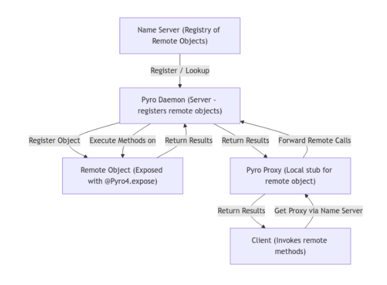

## Pyro4

Pyro es una libreria de Python que permite la comunicación entre objetos remotp. Permite la comunicación de manera sencilla y transparente, permitiendo que los objetos remotos se comporten como si fueran locales.

## Ejecución del codigo
Para los 4 ejemplos que hay, se recomienda usar la terminal. 
Primero hay que asegurarse de estar en el directorio correspondiente, y a continuación introducir el siguiente comando:
```bash 
python -m Pyro4.naming #Para iniciar el Name Server
```
Y luego simplemente ejecutar primero el servidor y a continuación el cliente, mediante la siguiente instrucción:
```bash
python server.py
python client.py
```

### Arquitectura Pyro
1. Name Server
- Los objetos remotos se registran con un nombre único. Solo guarda la referencia del objeto remoto
- Los clientes lo consultan para obtener la URI, que es la referencia del objeto remoto
- Sobretodo, antes de empezar hay que ejecutar ''' python -m Pyro4.naming''' para iniciar el Name Server
```python 
ns = Pyro4.locateNS() #Aqui se conecta al Name Server
ns.register("obj", uri) #Aqui se registra el objeto con el nombre "obj"
uri = ns.lookup("obj") #Aqui se busca el objeto con el nombre "obj"
```
- También es cierto, que si se dispone de la URI directamente, no es necesario el Name Server

2. Daemon (Servidor)
- Es el servidor que escucha las peticiones de los clientes y de registrarlos
- Funciones principales: Registar, ejecutar métodos remotos, devolver resultados

3. Proxy (Cliente)
- Objeto cliente que representa al objeto remoto
- Se obtiene a partir de la URI
- Manda las llamadas remotas al deamon
```python 
observable = Pyro4.Proxy(uri)  # Crear un proxy para el objeto observable
observable.notify("Hello, Observers!")  # Llamar a un método remoto
```	

