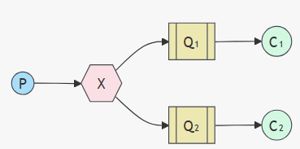

# Middleware services

## XMLRPC
En el caso del XMLRCP, permite que un cliente llame a la función de un servidor de forma remota usando XML para codificar mensajes y HTTP como protocolo de transporte.
El servidor, al recibir la solicitud XML, la procesa y ejecuta el método solicitado. El servidor tiene que estar preparado para recibir y entender los mensajes XML y ejecutar las funciones que el cliente le pida.
Una vez que el servidor ha procesado la solicitud, genera una respuesta en formato XML, que incluye el resultado de la ejecución del método.  El cliente recibe la respuesta del servidor, procesa la información y continúa con su ejecución.

### InsultServer
El servidor no tiene que estar preparado para recibir mensajes de los clientes, sino que simplemente responde a las solicitudes de los clientes. En este caso, XMLRCP esta escuchando de forma continua en el puerto 9000 y el cliente se conecta a ese puerto para enviar solicitudes al servidor. El servidor procesa la solicitud y devuelve una respuesta al cliente.

Este middleware no soporta publicación/subscripción. Solo permite invocaciones a métodos remotos desde el cliente hacia el servidor. Para somular un broadcast, los clientes (osea suscriptores) preguntan periodicamnete al servidor por nuevo insulto, osea lo que se conoce como 'polling'. En este caso, el servidor no envía mensajes a los clientes, sino que estos tienen que preguntar al servidor si hay nuevos insultos disponibles. El servidor responde con un insulto aleatorio cada vez que un cliente lo solicita. Esto permite que varios clientes obtengan insultos del servidor, pero no es una verdadera comunicación de publicación/suscripción.

Por tanto tenemos:
- Producer: Se encraga de generar los insultos y enviarlos al servidor. En este caso, el productor es el cliente del servidor. Cada 5 segundos ejecuta el metodo getInsult del servidor, que escoje un insulto aleatorio y se lo manda al consumidor.
- Consumer: Esta iniciado el servidor y espera a que el cliente le envíe una solicitud. Cuando el cliente le envía una solicitud, el servidor ejecuta el método getInsult y devuelve un insulto aleatorio al cliente. O ejecuta el metodo broadcastInsult, que devuelve un insulto aleatorio a todos los clientes que lo han solicitado (simulando la difusion de un broadcast y suscriptores).
- Receiver: Es el suscriptor que recibe el insulto del servidor. En este caso, el cliente se conecta al servidor y le envía una solicitud para obtener un insulto cada segundo. El servidor, que ejecuta la función broadcast, escoge un insulto aleatorio de la lista y lo devuelve. 

En la salida del servidor se puede ver el insulto que ha devuelto al cliente. Además podemos observar las peticiones que ha recibido el servidor con el timestamp: _127.0.0.1 - - [timestamp] "POST / HTTP/1.1" 200_

**Para ejecutar todo el servicio, se puede utilizar el siguiente comando en la terminal dentro de la ruta del InsultServer (XMLRPC/InsultServer):**

```bash
python .\execInsultServer.py
```


### InsultFilter
Este servicio se encarga de recibir textos desde clientes XML-RPC y comprobar si contienen insultos. Si detecta insultos, los sustituye por la palabra "CENSORED" y almacena tanto el texto original como el filtrado. El filtro es una lógica simple de Work Queue, donde los productores envían textos y el servidor los procesa uno a uno.

En este modelo, el servidor sigue escuchando continuamente en el puerto 9000 y responde a las solicitudes que recibe. Los clientes actúan como productores, y no existe comunicación directa entre los clientes: todos se comunican únicamente con el servidor.
Este modelo simula el patrón de procesamiento en cola (work queue), donde varios productores pueden enviar tareas (textos) a un único servidor que las procesa en orden de llegada.

A diferencia del ejemplo anterior de InsultServer, aquí no hay necesidad de que el cliente haga polling continuo ni de simular difusión. Simplemente cada productor envía datos al servidor, que los filtra en tiempo real.

Scripts:
- insultProducer.py: Se encarga de enviar textos al servidor. Cada 5 segundos envía un texto con insultos aleatorio al servidor para que lo procese.
- textProducer.py: Se encarga de enviar textos al servidor. Cada 5 segundos envía un texto sin insultos aleatorio al servidor para que lo procese.
- insultConsumer.py: Se encarga de recibir los textos del servidor y procesarlos. Cuando el servidor recibe un texto, lo filtra y devuelve el texto filtrado al cliente. El cliente imprime el texto original y el filtrado en la consola.

**Para ejecutar todo el servicio, se puede utilizar el siguiente comando en la terminal dentro de la ruta del InsultServer (XMLRPC/InsultFilter):**

```bash 
python .\execInsultFilter.py
```


## PyRO

### InsultServer

### InsultFilter

## REDIS

### InsultServer

### InsultFilter

## RabbitMQ
En el caso de RabbitMQ, se tarta de un servicio de comunicación indirecta. Se basa en el modelo publisher-subscriber, donde los productores envían mensajes a un intercambio (exchange) y los consumidores se suscriben a colas (queues) que reciben esos mensajes. RabbitMQ se encarga de enrutar los mensajes desde el productor hasta el consumidor adecuado, permitiendo una comunicación asíncrona y desacoplada entre ellos.
RabbitMQ utiliza el protocolo AMQP (Advanced Message Queuing Protocol) para la comunicación entre productores y consumidores. Los mensajes se envían a través de un intercambio, que actúa como un intermediario entre los productores y las colas. Los consumidores se suscriben a las colas y reciben los mensajes que se envían a esas colas.

### InsultServer
En este caso, al ser RabbitMQ un servicio de mensajería, el servidor InsultServer actúa como un productor de mensajes. En lugar de enviar respuestas directamente al cliente, el servidor envía mensajes a una cola de RabbitMQ. El cliente se suscribe a esa cola y recibe los mensajes que el servidor envía. Esto permite una comunicación asíncrona y desacoplada entre el servidor y el cliente.
Por tanto tenemos:
- El insultProducer -> cada 5 seg genera un insulto aleatorio y lo envía a la cola de RabbitMQ. Tipo de comunicación es point-to-point.
- El insultConsumer -> se suscribe a la cola de RabbitMQ y recibe los insultos que el productor envía. Tipo de comunicación es point-to-point.Podemos hacer load balancing entre varios consumidores, ya que cada uno de ellos se suscribe a la misma cola y RabbitMQ se encarga de distribuir los mensajes entre ellos. 
- El insultBroadcast -> Cada 5 seg, coje un insulto y lo publica para que cualquiera que este suscrito lo reciba. Tipo de comunicación es publish-subscribe.
- El insultSubscriber -> se suscribe a un fannout exchange de RabbitMQ y recibe los mensajes que se publican en ese exchange. Tipo de comunicación es publish-subscribe.

*El exchange se encarga de enrutar los mensajes a las colas adecuadas. Puede ser: direct, topic o fanout. En este caso, se utiliza un exchange de tipo fanout, que envía los mensajes a todas las colas suscritas a él. Direcrt: envía los mensajes a una cola específica. Topic: envía los mensajes a las colas que coinciden con un patrón de enrutamiento.

tutorial publicación y suscripción: https://www.rabbitmq.com/tutorials/tutorial-three-python

tutorial colas: https://www.rabbitmq.com/tutorials/tutorial-two-python



**Para ejecutar simplemente ejecutar en la terminal el siguiente comando dentro de la ruta del insultServer (RabbitMQ/InsultServer)**
```bash
 python .\execInsultServer.py
```

### InsultFilter
El Insult Filtter sigue la estructura de WorkQueue, donde el productor envía mensajes a una cola y los consumidores se suscriben a esa cola para recibir los mensajes. En este caso, el insultFilter actúa como un consumidor de mensajes que recibe insultos del servidor y los procesa.
Código del InsultFilter:
- insultConsumer.py: Cuando el cliente recibe una frase lo decodifica y lo limpia.
- insultProducer.py: Se encarga de enviar frases con y sin insultos a la cola de RabbitMQ

**Para ejecutar simplemente ejecutar en la terminal el siguiente comando dentro de la ruta del insultServer (RabbitMQ/InsultFiltter)**
```bash
 python .\execInsultFilter.py
```